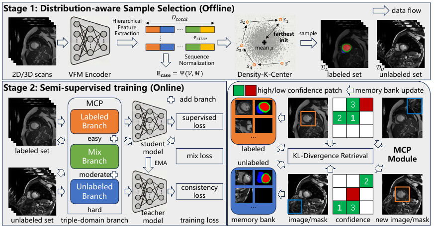

# DAA4SSMIS

Official PyTorch implementation of **Beyond Random Sampling: Distribution-Aware Alignment for Semi-Supervised Medical Image Segmentation**, accepted by ECCV 2026.

Weihao Yan, Yeqiang Qian, Yi Dong, and Ming Yang

[[Paper](https://arxiv.org/abs/2607.04249)]
[[Video](https://www.youtube.com/watch?v=AaDR-il_4jw&t=56s)]



## Release status

This release provides compact 2D examples and one 3D dataset example:

- **Stage 1:** hierarchical DINOv2 encoding and Density-K-Center (DKC) selection.
- **Training:** DINOv2-S + DPT with UniMatch V2 + BCP enabled by default.
- **Evaluation:** IoU/JC, Dice, ASD, and HD95; complete-volume metrics for PROMISE12.
- **2D examples:** BUSI and ISIC, including frozen DKC splits.
- **3D example:** PROMISE12: volume preparation, case-sequence DKC selection,
  slice-wise training, and volume-level evaluation. See the
  [PROMISE12 guide and presentation notes](docs/promise12_3d.md).

The paper's Stage 2 / MCP implementation is still being consolidated and is
not included in this version. The framework figure
shows the complete method for context.

## Repository layout

```text
configs/             BUSI, ISIC, and PROMISE12 configurations
dataset/             labeled/unlabeled dataset and augmentations
docs/                paper figures and 3D processing guide
model/               DINOv2 backbone and DPT segmentation head
scripts/             Stage 1, training, and evaluation wrappers
splits/              dataset partitions and frozen DKC splits
stage1/              feature extraction and DKC selection
tests/               Stage 1 and split-integrity tests
train.py             UniMatch V2 + BCP training entry point
evaluate.py          standalone evaluation entry point
```

## 1. Environment

The code was tested with Python 3.10 and CUDA-enabled PyTorch.

```bash
conda create -n daa4ssmis python=3.10 -y
conda activate daa4ssmis
pip install -r requirements.txt
```

Download the official
[DINOv2-Small checkpoint](https://dl.fbaipublicfiles.com/dinov2/dinov2_vits14/dinov2_vits14_pretrain.pth)
and place it at:

```text
pretrained/dinov2_small.pth
```

`data/`, `pretrained/`, experiment outputs, local configuration files, and
common Python/editor artifacts are excluded by `.gitignore`.

## 2. Prepare the data

The repository contains split files but does not distribute medical images.
The default configuration expects the following layout:

```text
data/
├── busi/
│   ├── image/train/...
│   ├── image/val/...
│   ├── label/train/...
│   └── label/val/...
└── isic/
    ├── image/train/...
    ├── image/val/...
    ├── label/train/...
    └── label/val/...
```

Each line in `splits/<dataset>/*.txt` contains an image path and its mask path,
relative to `data_root`. Space- and comma-separated pairs are supported:

```text
image/train/example.png label/train/example.png
```

Included annotation ratios are:

| Dataset | Classes | Ratios           |
| ------- | ------: | ---------------- |
| BUSI    |       2 | 1/16, 1/8, 1/4   |
| ISIC    |       2 | 1/80, 1/40, 1/20 |
| PROMISE12 |     2 | 1/16 (2 of 35 training cases) |

Frozen experiment splits live under
`splits/<dataset>/dkc/<ratio>/{labeled,unlabeled}.txt`.

PROMISE12 uses complete-case selection. Its 35/5/10 train/validation/test case
partition and the 1/16 example are included. For raw `.mhd` conversion and the
expected PNG layout, follow [the 3D guide](docs/promise12_3d.md).

## 3. Configure an experiment

Tracked defaults are provided in `configs/busi.yaml`, `configs/isic.yaml`, and
`configs/promise12.yaml`.
The most commonly changed fields are:

| Field             | Meaning                           | Default            |
| ----------------- | --------------------------------- | ------------------ |
| `data_root`     | dataset directory                 | `data/<dataset>` |
| `crop_size`     | model input size                  | `518`            |
| `epochs`        | training epochs                   | `180`            |
| `batch_size`    | batch size per GPU                | `4`              |
| `lr`            | DINOv2 encoder learning rate      | `5e-6`           |
| `lr_multi`      | decoder learning-rate multiplier  | `40`             |
| `conf_thresh`   | pseudo-label confidence threshold | `0.95`           |
| `eval_interval` | validation frequency in epochs    | `10`             |

To keep machine-specific paths out of Git, copy a configuration into the
ignored `configs/local/` directory:

```bash
mkdir -p configs/local
cp configs/busi.yaml configs/local/busi.yaml
# Edit configs/local/busi.yaml and set data_root, batch_size, etc.
```

The wrapper scripts accept these environment overrides:

| Variable              | Used by        | Purpose                   |
| --------------------- | -------------- | ------------------------- |
| `CONFIG_PATH`       | train/evaluate | custom YAML configuration |
| `DATA_ROOT`         | Stage 1        | dataset directory         |
| `DINOV2_WEIGHTS`    | Stage 1/train  | encoder checkpoint        |
| `LABELED_ID_PATH`   | train          | custom labeled split      |
| `UNLABELED_ID_PATH` | train          | custom unlabeled split    |

Example:

```bash
CONFIG_PATH=configs/local/busi.yaml \
DINOV2_WEIGHTS=/path/to/dinov2_vits14_pretrain.pth \
bash scripts/train.sh 2 29500 busi 1_16
```

## 4. Run Stage 1

The wrapper extracts L2-normalized descriptors from four DINOv2 layers and
runs DKC with `k=20`:

```bash
bash scripts/stage1.sh busi 1_16
bash scripts/stage1.sh promise12 1_16

DATA_ROOT=/datasets/isic \
DINOV2_WEIGHTS=/checkpoints/dinov2_vits14_pretrain.pth \
bash scripts/stage1.sh isic 1_80
```

Generated splits are written to
`work_dirs/stage1/<dataset>/splits/<ratio>/`. The extractor and selector can
also be invoked separately; run either module with `--help` for all options.
For PROMISE12, the wrapper automatically enables `--case-sequence`: naturally
ordered slices are centered to a common depth, compared with aligned-slice
cosine distance, and selected as whole cases. Selection never reads masks.

## 5. Train

BCP is enabled by default:

```bash
bash scripts/train.sh 2 29500 busi 1_16
bash scripts/train.sh 2 29500 isic 1_80
bash scripts/train.sh 2 29500 promise12 1_16
```

Outputs default to `work_dirs/<dataset>/<ratio>/unimatchv2_bcp`. Training saves
`latest.pth` after every epoch and selects `best.pth` using EMA validation Dice.
Resume is automatic when `latest.pth` exists in the output directory.
For PROMISE12, checkpoint selection uses mean foreground case Dice at the
configured evaluation size. All slices of each case are assigned to the same
evaluation process, without duplicated padding cases.

To use a newly generated Stage 1 split:

```bash
LABELED_ID_PATH=work_dirs/stage1/busi/splits/1_16/labeled.txt \
UNLABELED_ID_PATH=work_dirs/stage1/busi/splits/1_16/unlabeled.txt \
bash scripts/train.sh 2 29500 busi 1_16
```

Pass `--no-bcp` directly to `train.py` to run plain UniMatch V2. Optional
labeled-only BCP pretraining is available through `--bcp-pretrain-epochs N`.

## 6. Evaluate

Evaluation uses the EMA teacher by default:

```bash
bash scripts/evaluate.sh 29501 busi \
  work_dirs/busi/1_16/unimatchv2_bcp best val

bash scripts/evaluate.sh 29501 promise12 \
  work_dirs/promise12/1_16/unimatchv2_bcp best test

CONFIG_PATH=configs/local/isic.yaml \
bash scripts/evaluate.sh 29501 isic \
  work_dirs/isic/1_80/unimatchv2_bcp best val
```

Use `--weights model` with `evaluate.py` to evaluate student weights. To use a
separate test set, add `splits/<dataset>/test.txt` and pass `test` to the
wrapper's final argument.

## Acknowledgements

The training baseline builds on
[UniMatch V2](https://github.com/LiheYoung/UniMatch-V2). BCP refers to
*Bidirectional Copy-Paste for Semi-Supervised Medical Image Segmentation*
(CVPR 2023), and the encoder implementation follows DINOv2. See
[`NOTICE`](NOTICE) for attribution and release-scope details.

## Citation

```bibtex
@inproceedings{yan2026beyond,
  title     = {Beyond Random Sampling: Distribution-Aware Alignment for Semi-Supervised Medical Image Segmentation},
  author    = {Yan, Weihao and Qian, Yeqiang and Dong, Yi and Yang, Ming},
  booktitle = {European Conference on Computer Vision},
  year      = {2026}
}
```

## License

Released under the [MIT License](LICENSE).
